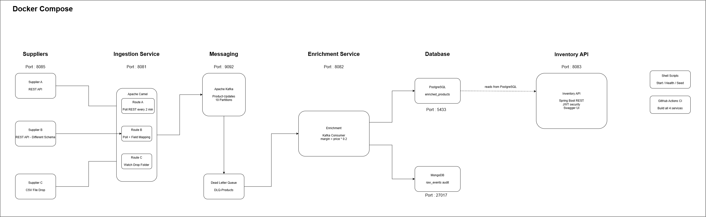

# SmartSupply Hub

> Enterprise supply chain integration platform built with Apache Kafka, Apache Camel, and Spring Boot microservices.

[](https://github.com/Pasan-Yashobha/smartsupply-hub/actions/workflows/ci.yml)

---

## What it does

SmartSupply Hub ingests product data from three different suppliers, each using a completely different protocol. It normalises everything into a unified format, streams it through Apache Kafka, enriches it with business logic, and exposes it via a JWT-secured REST API with Swagger documentation.

This project mirrors real enterprise integration consultant work at companies like Yenlo, WSO2, and Nagarro.

---

## Architecture



| Layer | Technology | Port |
|---|---|---|
| Supplier mocks | Spring Boot REST + CSV scheduler | 8085 |
| Ingestion service | Apache Camel routes | 8081 |
| Message broker | Apache Kafka (10 partitions) | 9092 |
| Enrichment service | Kafka consumer + JPA + MongoDB | 8082 |
| Inventory API | Spring Boot REST + JWT + Swagger | 8083 |
| Primary database | PostgreSQL | 5433 |
| Audit log | MongoDB | 27017 |

---

## Services

### supplier-mocks
Simulates three real-world supplier systems:
- **Supplier A** - REST API with standard field names
- **Supplier B** - REST API with a completely different schema (`productCode`, `unitPrice`, `vendor`) requiring field mapping
- **Supplier C** - scheduled CSV file drop every 60 seconds

### ingestion-service
Apache Camel integration routes for each supplier:
- `SupplierARestRoute` - polls REST API every 2 minutes via timer
- `SupplierBRestRoute` - polls REST API and maps different field names to unified `ProductEvent`
- `SupplierCFileRoute` - watches drop folder, splits CSV rows, publishes to Kafka

All three routes publish normalised `ProductEvent` JSON to the `product-updates` Kafka topic.

### enrichment-service
Kafka consumer that processes every product event:
- Calculates margin (`price x 0.2`)
- Saves enriched product to PostgreSQL (`enriched_products` table)
- Saves raw event to MongoDB (`raw_events` collection) as audit log

### inventory-api
JWT-secured REST API exposing enriched inventory data:
- `GET /api/v1/products` - paginated product list
- `GET /api/v1/products/{id}` - single product by ID
- `GET /api/v1/products/supplier/{supplier}` - filter by supplier
- `POST /api/v1/auth/token` - generate JWT token
- Swagger UI at `/swagger-ui/index.html`

---

## Tech stack

- **Java 21** - Microsoft OpenJDK
- **Spring Boot 3.x** - microservices framework
- **Apache Camel 4.x** - integration routes and Enterprise Integration Patterns
- **Apache Kafka** - event streaming with 10-partition topic
- **PostgreSQL** - enriched product persistence
- **MongoDB** - raw event audit log
- **MapStruct** - entity to DTO mapping
- **JWT (jjwt)** - API authentication
- **SpringDoc OpenAPI** - Swagger UI documentation
- **Docker + Docker Compose** - full stack containerisation
- **GitHub Actions** - CI pipeline building all four services

---

## Running locally

### Prerequisites
- Docker Desktop with WSL2 integration enabled
- Java 21

### Start the full stack

```bash
# Start all 8 containers
cd infra
docker compose up --build -d

# Verify everything is running
cd ..
./scripts/healthcheck.sh
```

### Seed Kafka topics

```bash
./scripts/seed-kafka.sh
```

### Access Swagger UI

```
http://localhost:8083/swagger-ui/index.html
```

Get a JWT token:
```bash
curl -X POST http://localhost:8083/api/v1/auth/token \
  -H "Content-Type: application/json" \
  -d '{"username":"admin","password":"smartsupply123"}'
```

Use the token in Swagger UI, click **Authorize**, and paste the token.

---

## Project structure

```
smartsupply-hub/
├── supplier-mocks/        # Simulated supplier REST APIs and CSV drops
├── ingestion-service/     # Apache Camel integration routes
├── enrichment-service/    # Kafka consumer + dual DB persistence
├── inventory-api/         # JWT REST API + Swagger
├── infra/                 # Docker Compose for full stack
├── scripts/               # Operational shell scripts
│   ├── start-all.sh
│   ├── stop-all.sh
│   ├── healthcheck.sh
│   └── seed-kafka.sh
├── docs/
│   └── architecture.png
└── .github/workflows/
    └── ci.yml
```

---

## Key design decisions

See [`decisions.md`](decisions.md) for full reasoning behind each architectural choice.

---

## Author

**Pasan Yashobha Gunawardena**
IT Undergraduate, Faculty of Information Technology, University of Moratuwa

[](https://www.linkedin.com/in/pasan-yashobha-17602b305)
[](https://github.com/Pasan-Yashobha)